# 2.1 MCS-51单片机的基本组成

## 2.1.1 MCS-51单片机的基本组成

### 1.中央处理器

### 2.内部程序存储器

内部ROM

存放程序、原始数据、表格内容

### 3.内部数据存储器

RAM的低128B

存放随机数据及运算结果

### 4.定时/计数器

2个16位

### 5.并行IO口

4个8位并行IO

P0：低8位地址/8位数据，GPIO

P1：GPIO

P2：高8位地址，GPIO

P3：第二功能输入、输出，GPIO

### 6.串行口

全双工异步通信收发

### 7.中断控制系统

2个外部中断源

2个定时/计数器中断源

1个串行中断源

### 8.时钟电路

外接石英晶体和微调电容

8051：25MHz

89C51：24MHz

89S51：33MHz

### 9.位处理器

### 10.内部总线

## 2.1.2 封装及引脚

### 一、封装

DIP-40 双列直插

### 二、引脚

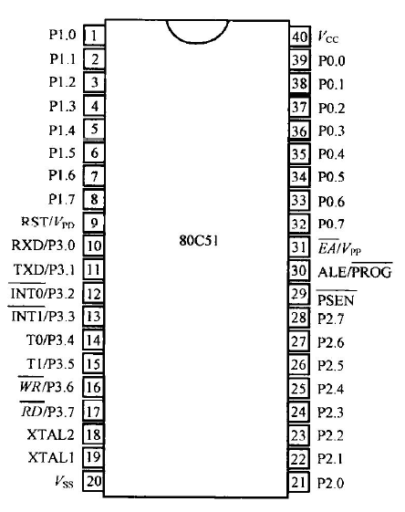

#### 1.输入、输出

P0-P3

#### 2.电源及时钟

$V_{CC}$：+5V

$V_{SS}$：GND

XTAL：晶振

#### 3.控制线和复位

ALE：访问外部存储器时锁存地址；不访问时输出振荡器频率1/6的正脉冲信号

$\overline{EA}$：EA为低时，只访问外部程序存储器；EA为高时，先访问内部，超出容量后访问外部

$\overline{PSEN}$：访问外部程序存储器时每周期两次有效

RST：两个周期高电平触发复位

### 三、第二功能

#### 1.P3

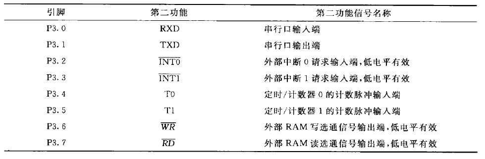

#### 2.烧录

$\overline {PROG}$拉低，VPP接25V

#### 3.备用电源

$V_{PD}$保护内部RAM不掉电


# 2.2 MCS-51单片机的并行I/O端口结构

## 2.2.1 P1口

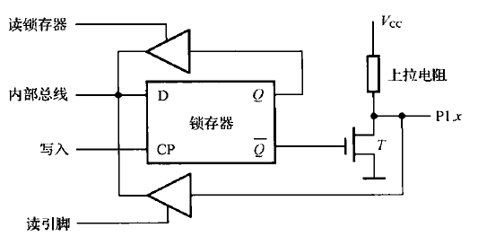

上拉电阻为场效应管等效

输入前应输出1防止短路（准双向I/O口）

## 2.2.2 P2口

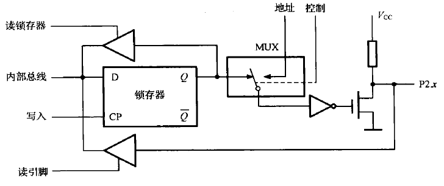

## 2.2.3 P3口

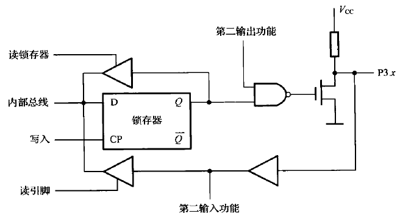

第一输出功能：第二输出功能信号线置1，与非门充当非门

第二输出功能：锁存器置1，与非门充当非门

第一输入功能：锁存器置1，第二输出功能信号线置1，场效应管截止

第二输入功能：锁存器置1，第二输出功能信号线置1，场效应管截止

## 2.2.4 P0口

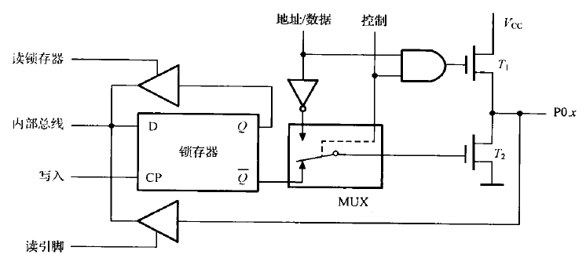


# 2.3 MCS-51单片机的存储器结构

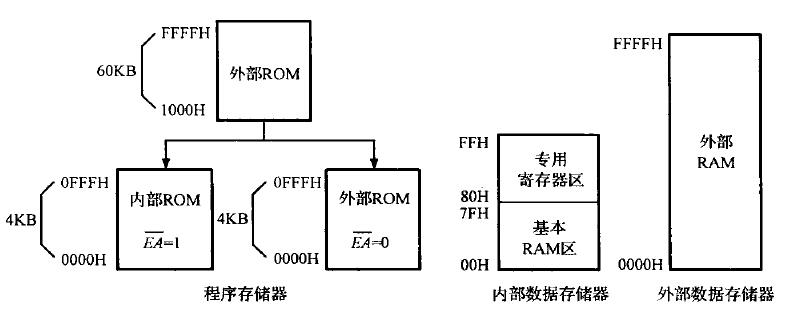

## 2.3.1 程序存储器ROM

$\overline{EA}=1$，单片机先执行片内4KB，地址超出后自动转向片外

$\overline{EA}=0$，单片机执行片外程序存储器内容

0003H-002AH单元均匀分为5段

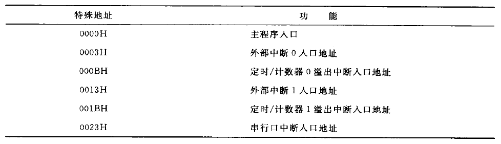

主程序从0030H单元之后开始

## 2.3.2 数据存储器RAM

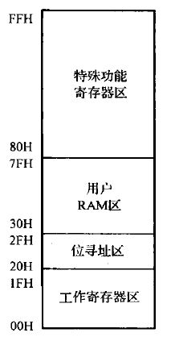

内部数据存储器：256B，00H-FFH，使用`MOV`访问

外部数据存储器：最大64KB，0000H-FFFFH，使用`MOVX`访问

### 一、基本RAM区

#### 1.工作寄存器区 00H-1FH

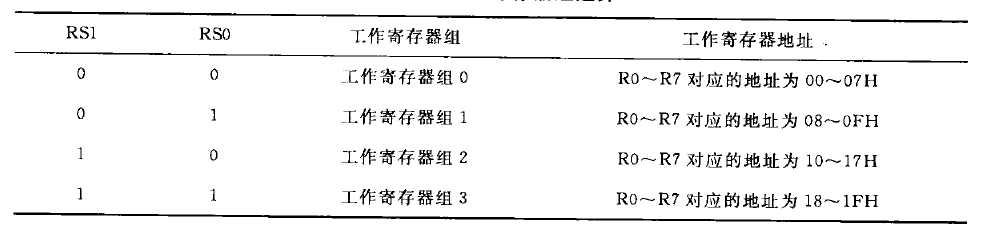

#### 2.位寻址区 20H-2FH

16个单元，共16*8=128位，既可以按字节寻址，也可以按位寻址

#### 3.用户RAM区 30H-7FH

80个单元，按字节寻址

### 二、特殊功能寄存器区

#### 1.程序计数器PC

16位，存放下一条指令地址，自动加1

#### 2.累加器A/ACC

8位，E0H，可存放操作数

#### 3.B寄存器

8位，F0H，主要用于乘除运算，也可作为一般数据寄存器使用

#### 4.数据指针寄存器DPTR

16位

DPH：DPTR高位字节，83H

DPL：DPTR低位字节，82H

访问外部数据存储器时作地址指针使用

#### 5.程序状态字寄存器PSW

8位，D0H

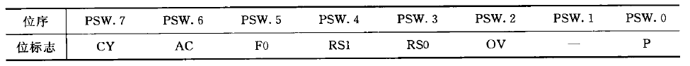

##### CY

进位标志位

##### AC

辅助进位标志位

##### F0

用户标志位，自行决定

##### RS1、RS0

选择工作寄存器组

##### OV

溢出标志位

##### P

奇偶标志位，累加器A中1为偶数置0，反之置1

#### 6.堆栈指针寄存器SP

8位，81H，存放堆栈栈顶地址

堆栈遵循LIFO，向上生长

进栈操作：`PUSH`，先SP加1，后写入数据

出栈操作：`POP`，先读出数据，后SP减1

SP初值为07H，但一般设置为30H-7FH地址空间的高端


# 2.4 MCS-51单片机的时钟电路与时序

## 2.4.1 时钟电路

### 一、内部时钟

XTAL1与XTAL2跨接晶体或陶瓷振荡器

晶体振荡器选择20-40pF电容，陶瓷振荡器选择30-50pF电容

### 二、外部时钟

针对AT89，XTAL1接外部时钟，XTAL2悬空

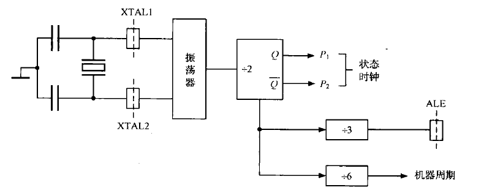

## 2.4.2 时序

### 一、振荡周期

晶振的振荡周期

### 二、时钟周期

振荡脉冲二分频后的信号周期

### 三、机器周期

一个机器周期 - 6个状态 - 12个节拍（振荡周期）

### 四、指令周期

执行一条指令需要的时间


# 2.5 MCS-51单片机的工作方式

## 2.5.1 复位方式

### 一、复位信号

RST保持两个机器周期（24个振荡周期）以上高电平触发复位

### 二、复位操作

复位使得PC初始化至0000H，ALE与$\overline{PSEN}$无效，不影响RAM

### 三、复位方式

#### 1.上电自动复位

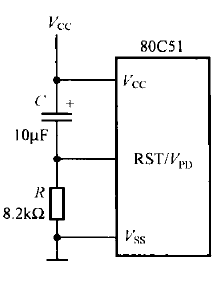

#### 2.按键手动复位

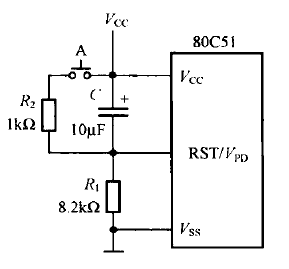

## 2.5.2 程序执行方式

复位后系统指针指向0000H，在0000H处放置长转移指令转移至中断服务区后面（0030H）

## 2.5.3 单步执行方式

### 一、外部电路

按钮连接$\overline{INT0}$，按钮按下高电平，放开低电平

### 二、中断程序

```assembly
JNB P3.2,$  ;INT0为0时阻塞
JB  P3.2,$  ;INT0为1时阻塞
RETI        ;返回
```

## 2.5.4 低功耗方式

### 一、HMOS单片机掉电方式

主电源电压小于备用电源时，进入掉电中断，将有用数据保存至内部RAM中后由备用电源向RAM供电，时钟与CPU皆停止

主电源恢复后自动恢复现场

### 二、CHMOS单片机节电运行方式

由电源控制寄存器PCON（87H）控制

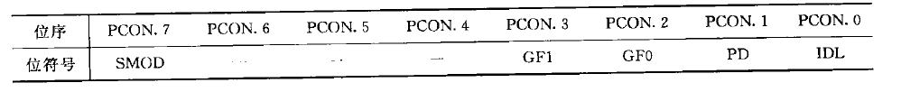

PD=1，进入掉电方式

IDL=1，进入待机方式

#### 待机方式

振荡器工作，切断时钟到CPU的通路，中断、串口、定时器正常允许

退出：激活任意中断；复位

#### 掉电方式

振荡器停止

退出：复位

## 2.5.5 EPROM的编程和校验工作方式