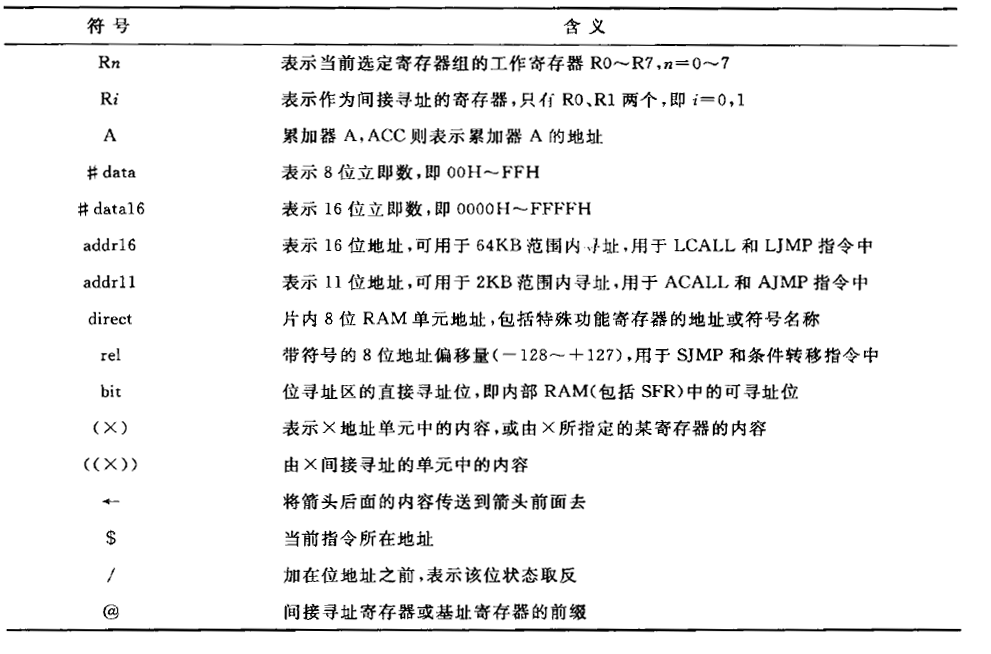

# 3.1 指令格式及其符号说明

## 3.1.1 指令格式

[标号:] 助记符 [目的操作数],[源操作数] [;注释]

## 3.1.2 常用符号说明



## 3.1.3 指令的字节

### 一、单字节指令

### 二、双字节指令

### 三、三字节指令


# 3.2 寻址方式

## 3.2.1 立即寻址

```assembly
MOV A , #25H       ;将8位立即数25H赋值给累加器A
MOV DPTR , #1234H  ;将16位立即数赋值给数据指针DPTR
```

## 3.2.2 直接寻址

```assembly
MOV A , 50H        ;将50H所存的数据赋值给累加器A。只能使用8位地址，因此只能寻址内部RAM
MOV A , P1         ;直接寻址是访问特殊功能寄存器的唯一方法
```

## 3.2.3 寄存器寻址

```assembly
MOV A , R7         ;将寄存器R7的内容赋值给累加器A
```

## 3.2.4 寄存器间接寻址

```assembly
MOV A , @R0        ;将寄存器R0的内容作为地址，把该地址内容赋值给累加器A
```

R0，R1，DPTR可用于寄存器寻址

Ri可访问内部RAM低128字节与外部RAM低256字节

DPTR访问全部64KB外部RAM

## 3.2.5 变址寻址

```assembly
MOVC A , @A+DPTR   ;将累加器A与DPTR内容相加作为地址，将地址内容赋值给累加器A，@作用于A+DPTR
```

## 3.2.6 相对寻址

```assembly
SJMP 50H           ;将读取当前指令后的PC与操作数相加，得到地址后跳转
```

## 3.2.7 位寻址


# 3.3 MCS-51单片机指令系统

## 3.3.1 数据传送类指令

### 一、普通传送指令

#### 1.片内数据存储器传送指令

```assembly
MOV A , #data			;立即寻址
MOV A , direct			;直接寻址
MOV A , Rn				;寄存器寻址
MOV A , @Ri				;寄存器间接寻址

MOV Rn , #data			;立即寻址
MOV Rn , direct			;直接寻址
MOV Rn , A				;寄存器寻址

MOV direct , #data		;立即寻址
MOV direct , direct		;直接寻址
MOV direct , A			;寄存器寻址
MOV direct , Rn			;寄存器寻址
MOV direct , @Ri		;寄存器间接寻址

MOV @Ri , #data			;立即寻址
MOV @Ri , direct		;直接寻址
MOV @Ri , A				;寄存器寻址

MOV DPTR , #data16		;立即寻址
```

#### 2.片外数据存储器传送指令

只能通过**累加器A**与片外数据存储器数据传送，且只能通过@Ri与@DPTR**间接寻址**

```assembly
MOVX A , @Ri 			 ;只能寻址低8位
MOVX @Ri , A			 ;只能寻址低8位
MOVX A , @DPTR
MOVX @DPTR , A
```

#### 3.程序存储器传送指令

```assembly
MOVC A , @A+DPTR		 ;寻址64KB
MOVC A , @A+PC			 ;寻址256B
```

### 二、数据交换指令

#### 1.整字节交换指令

8位数据交换

```assembly
XCH A , Rn
XCH A , direct
XCH A , @Ri
```

#### 2.半字节交换指令

低4位数据交换

```assembly
XCHD A , @Ri
```

#### 3.累加器高低半字节交换指令

```assembly
SWAP A
```

### 三、堆栈操作指令

```assembly
PUSH direct				;SP+1,存入direct
POP direct				;读取direct,SP-1
```

## 3.3.2 算术运算类指令

### 一、加法指令

#### 1.不带进位

```assembly
ADD A , #data			;A=(A)+data
ADD A , direct			;A=(A)+(direct)
ADD A , Rn				;A=(A)+(Rn)
ADD A , @Ri				;A=(A)+((Ri))
```

第7位有进位，CY=1

第3位有进位，AC=1

第6、7位有一个进位，OV=1

#### 2.带进位

```assembly
ADDC A , #data			;A=(A)+data+(CY)
ADDC A , direct			;A=(A)+(direct)+(CY)
ADDC A , Rn				;A=(A)+(Rn)+(CY)
ADDC A , @Ri			;A=(A)+((Ri))+(CY)
```

#### 3.加1指令

```assembly
INC A
INC direct
INC Rn
INC @Ri
INC DPTR
```

### 二、减法指令

#### 1.带借位的减法指令

```assembly
SUBB A , #data			;A=(A)-data-(CY)
SUBB A , direct			;A=(A)-(direct)-(CY)
SUBB A , Rn				;A=(A)-(Rn)-(CY)
SUBB A , @Ri			;A=(A)-((Ri))-(CY)
```

第7位有借位，CY=1

第3位有借位，AC=1

第6、7位有一个借位，OV=1

#### 2.减1指令

```assembly
DEC A
DEC direct
DEC Rn
DEC @Ri
```

### 三、乘法指令

```assembly
MUL AB
```

将累加器A与寄存器B相乘，得到16位乘积，高位在A，低位在B

### 四、除法指令

```assembly
DIV AB
```

被除数为A，除数为B；执行后商为A，余数为B

### 五、十进制调整指令

```assembly
MOV A , #93H
ADD A , #59H
DA A
```

将A调整为BCD码

## 3.3.3 逻辑运算及移位类指令

### 一、与

```assembly
ANL A , #data
ANL A , direct
ANL A , Rn
ANL A , @Ri
ANL direct , #data
ANL direct , A
```

将源操作数与目标操作数按位取与

### 二、或

```assembly
ORL A , #data
ORL A , direct
ORL A , Rn
ORL A , @Ri
ORL direct , #data
ORL direct , A
```

将源操作数与目标操作数按位取或

### 三、异或

```assembly
XRL A , #data
XRL A , direct
XRL A , Rn
XRL A , @Ri
XRL direct , #data
XRL direct , A
```

将源操作数与目标操作数按位取异或

### 四、累加器清零与取反

```assembly
CLR A				;清零
COL A				;取反
```

### 五、循环移位

```assembly
RL A				;累加器循环左移
RR A				;累加器循环右移
RLC A				;带进位累加器循环左移
RRC A				;带进位累加器循环左移
```

## 3.3.4 控制转移类指令

### 一、无条件转移

#### 1.长转移指令

```assembly
LJMP addr16			;将16位地址送PC
```

#### 2.绝对转移指令

```assembly
AJMP addr11			;PC高5位不变，赋值低11位
```

#### 3.短转移指令

```assembly
SJMP rel			;PC当前值加rel，rel是补码形式有符号数
```

#### 4.变址寻址转移指令

```assembly
JMP @A+DPTR			;将A与DPTR内容相加得到地址
```

### 二、条件转移

#### 1.累加器判零转移指令

```assembly
JZ rel				;若A=0则PC=PC+2+rel
JNZ rel				;若A≠0则PC=PC+2+rel
```

#### 2.比较转移指令

```assembly
CJNE A , #data , rel		;不等时转移，若目的操作数大于等于源操作数，CY=0；目的操作数小于源操作数，CY=1
CJNE A , direct , rel		;可使用该特性实现数值比较
CJNE Rn , #data , rel
CJNE @Ri , direct , rel
```

#### 3.减1非零转移指令

```assembly
DJNZ Rn , rel				;Rn-1后不为0则跳转
DJNZ direct , rel
```

### 三、子程序调用及返回

#### 1.长调用指令

```assembly
LCALL addr16				;PC+3；分两次将PC压入堆栈，先压低位；将地址送入PC
```

#### 2.绝对调用指令

```assembly
ACALL addr11				;PC+2；分两次将PC压入堆栈，先压低位；将11位地址送入PC低位
```

#### 3.子程序返回指令

```assembly
RET							;自动从堆栈中取出PC
```

#### 4.中断返回指令

```assembly
RETI						;自动从堆栈中取出PC
```

### 四、空指令

```assembly
NOP							;延迟一个机器周期
```

## 3.3.5 位操作类指令

### 一、位传送指令

```assembly
MOV C , bit					;实现可寻址位与位累加器CY之间的传送
MOV bit , C
```

### 二、位置位与清零指令

```assembly
SETB C						;置1
SETB bit
CLR C						;置0
CLR bit
```

### 三、位运算指令

```assembly
ANL C , bit					;CY与bit
ANL C , /bit				;CY与bit非
ORL C , bit					;CY或bit
ORL C , /bit
CPL C						;C非
CPL bit
```

### 四、位控制转移指令

#### 1.以C为条件

```assembly
JC rel						;若CY=1则跳转
JNC rel						;若CY=0则跳转
```

#### 2.以位地址内容为条件

```assembly
JB bit , rel				;bit=1则跳转
JNB bit , rel				;bit=0则跳转
JBC bit , rel				;bit=1则跳转且bit清零
```

