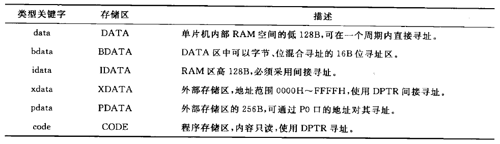

# 5.1 C51数据与运算

## 5.1.1 C51的数据类型

bit：位变量

sbit：可位寻址空间的一个位

sfr：特殊功能寄存器

sfr16：16位特殊功能寄存器

## 5.1.2 C51数据的存储类型



## 5.1.3 8051特殊功能寄存器的C51定义

### 1.sfr

```c
sfr P0 = 0x80;		//等号后必须是常数
```

### 2.sfr16

对于8051派生系列单片机，可以什么两个连续地址的特殊功能寄存器

### 3.sbit

可位寻址的特殊功能寄存器和其他可位寻址目标

```c
sfr KEYS = 0x80;
sbit KEY_UP = KEYS ^ 1;			//KEYS的第一位

sbit TF0 = 0x88 ^ 5;			//0x88的第五位

sbit TF0 = 0x8D;				//绝对地址
```

## 5.1.4 8051并行接口及位变量的C51定义

```c
sfr P0 = 0x80;
sfr P1 = 0x90;

sbit P0_0 = 0x80;
sbit P0_1 = 0x81;
```


# 5.2 C51运算符、表达式及其规则

略


# 5.3 C51流程控制语句

略


# 5.4 C51构造数据类型

## 5.4.1 数组

在声明时，变量不能作为数组的维数

## 5.4.2 指针

## 5.4.3 结构体

## 5.4.4 共用体

## 5.4.5 枚举


# 5.5 函数

## 5.5.1 函数的定义

## 5.5.2 函数的调用

## 5.5.3 函数的嵌套与递归

### 一、嵌套

每次调用嵌套都将使8051系统把2字节压入堆栈中，而C编译器依靠堆栈来进行参数传递

一个函数内应将嵌套调用的层次限制在四五层以内

### 二、递归

## 5.5.4 中断服务函数

### 一、中断服务函数的定义

```c
返回值类型 函数名() interrupt 中断号 using 寄存器组号
{
	函数体语句
}
```

1. 中断函数不能传参
2. 中断函数无返回值
3. 不能直接调用中断函数
4. 中断函数中调用其他函数，要确保使用的寄存器相同

### 二、修饰符interrupt

中断号取值为0-31

0：外部中断0

1：T0

2：外部中断1

3：T1

4：串口中断

5：T2

其他值预留

### 三、修饰符using

指定本函数内部使用的工作寄存器组，取值为0-3

## 5.5.5 指向函数的指针变量

## 5.5.6 局部变量与全局变量

外部变量与局部变量同名时，在局部变量的作用范围内，外部变量被屏蔽


# 5.6 C51的库函数

略


# 5.7 C51模块化程序设计

略