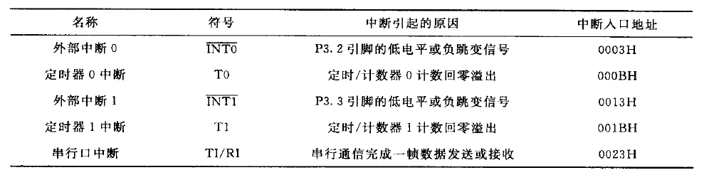
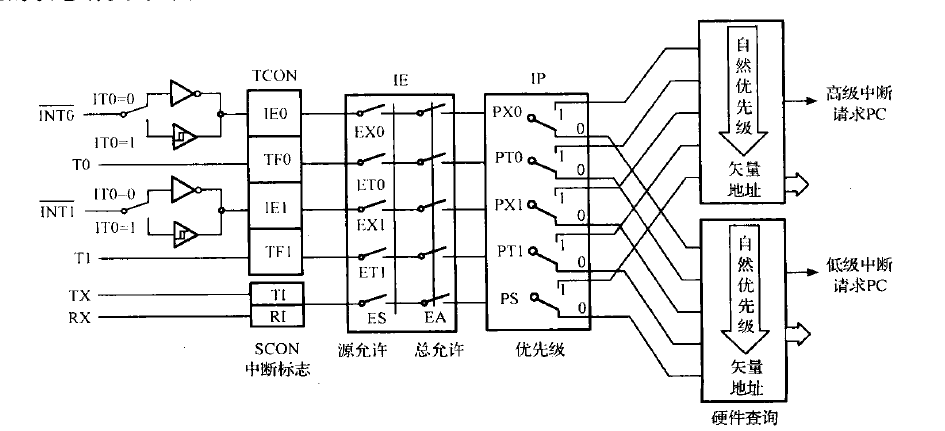
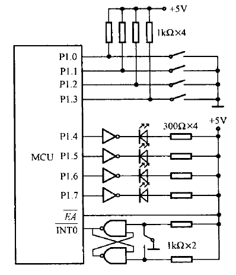
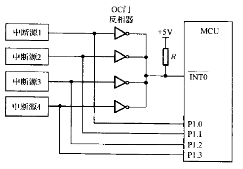
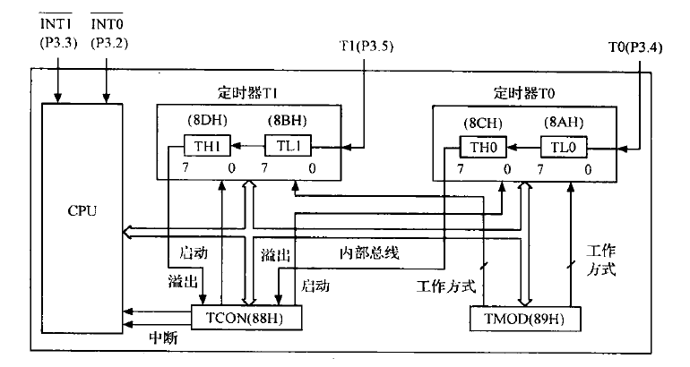

# 6.1 中断系统

## 6.1.1 中断概述

```flow
step1=>start: 执行主程序
step2=>operation: 执行一条指令
step3=>condition: 是否有中断请求
step4=>operation: 取下一条指令
step5=>operation: 关中断，保护现场，开中断
step8=>operation: 中断服务
step9=>operation: 关中断，恢复现场，开中断
step12=>end: 返回断点

step1->step2->step3
step3(no)->step4(top)->step2
step3(yes)->step5->step8->step9->step12
```

## 6.1.2 中断源



### 一、外部中断源

$\overline {INT0}$与$\overline {INT1}$

电平方式与脉冲方式

### 二、定时/计数器中断源

计数溢出时产生中断

### 三、串行口中断

串口完成一帧信息后将发送或接受中断标志位置1

## 6.1.3 中断控制

### 一、TCON

| 位地址 | 8FH  | 8DH  | 8BH  | 8AH  | 89H  | 88H  |
| :----: | :--: | :--: | :--: | :--: | :--: | :--: |
| 位符号 | TF1  | TF0  | IE1  | IT1  | IE0  | IT0  |

#### 1.IE0/IE1

外部中断有效时置1，进入中断服务后自动置0

#### 2.IT0/IT1

为0时外部中断电平触发，为1时外部中断脉冲触发

#### 3.TF0/TF1

定时/计数器溢出时置1，进入中断服务后自动置0

### 二、SCON

| 位地址 | 99H  | 98H  |
| :----: | :--: | :--: |
| 位符号 |  TI  |  RI  |

#### 1.TI

串口发送完一帧信息后自动置1，进入中断服务后手动置0

#### 2.RI

串口接收完一帧信息后自动置1，进入中断服务后手动置0

### 三、IE

| 位地址 | 0AFH | 0AEH | 0ADH | 0ACH | 0ABH | 0AAH | 0A9H | 0A8H |
| :----: | :--: | :--: | :--: | :--: | :--: | :--: | :--: | :--: |
| 位符号 |  EA  |  -   |  -   |  ES  | ET1  | EX1  | ET0  | EX0  |

#### 1.EA

中断总开关，高电平有效

#### 2.EX0/EX1

外部中断开关，高电平有效

#### 3.ET0/ET1

定时/计数器中断开关，高电平有效

#### 4.ES

串口中断开关，高电平有效

### 四、IP

| 位地址 | 0BFH | 0BEH | 0BDH | 0BCH | 0BBH | 0BAH | 0B9H | 0B8H |
| :----: | :--: | :--: | :--: | :--: | :--: | :--: | :--: | :--: |
| 位符号 |  -   |  -   |  -   |  PS  | PT1  | PX1  | PT0  | PX0  |

为0时为低优先级，1时为高优先级

#### 1.PX0/PX1

外部中断优先级设定

#### 2.PT0/PT1

定时/计数器中断优先级设定

#### 3.PS

串口中断优先级设定

#### 响应原则

高优先级可打断低优先级，反之不可

同级不能嵌套

同级同时出现响应顺序：外部0 -> 定时器0 -> 外部1 -> 定时器1 -> 串口

## 6.1.4 中断响应过程

### 一、中断采样

### 二、中断标志位查询



### 三、中断响应

硬件生成长调用指令，将PC压栈后将中断入口送入PC，中断入口地址放置无条件转移指令

### 四、中断响应时间

## 6.1.5 中断请求的撤除

### 一、定时/计数器中断

响应后硬件自动撤除

### 二、外部中断

#### 1.脉冲方式

响应后硬件自动撤除

#### 2.电平方式

标志位在响应后硬件自动撤除

需要手动把外部中断输入端置1

### 三、串行中断

在中断服务内撤除

## 6.1.6 中断程序设计

**中断初始化**

1. CPU开关中断
2. 设置中断源开关
3. 设置中断优先级
4. 使用外部中断时设置电平/脉冲触发

### 一、汇编语言

外部中断时将开关状态反映至LED上



```assembly
		ORG 0000H
		AJMP MAIN		;无条件转移
		
		ORG 0003H
		AJMP SER		;指向中断服务函数
		
		ORG 0030H
MAIN:	MOV P1,#0FH		;输出高电平保持LED熄灭
		SETB IT0		;外部中断脉冲触发
		SETB EX0		;允许外部中断
		SETB EA			;打开中断总开关
		AJMP $			;阻塞
SER:	MOV P1,#0FH		;输出高电平保持LED熄灭，且防止读取IO时大短路
		MOV A,P1		;读取IO状态
		CPL A			;取反
		ANL A,#0FH		;屏蔽A高半字节
		SWAP A			;交换高低半字节
		MOV P1,A		;输出
		RETI			;中断返回
```

### 二、C语言

```c
#include<reg51.h>
void int0() interrupt 0{
    P1 = 0x0f;
    P1<<=4;
    ~P1
}
main(){
    EA = 1;
    EX0 = 1;
    IT0 = 1;
    while(1);
}
```

## 6.1.7 外部中断源的扩展

### 一、利用定时器扩展外部中断源

将定时器装载值设置为0FFH，外部中断接入技术输入端

### 二、利用硬件申请软件查询拓展外部中断源



利用线或功能触发中断，读取IO判断中断源


# 6.2 定时/计数器

## 6.2.1 定时/计数器的结构及工作原理

### 一、结构



### 二、工作原理

#### 1.用作定时器

输入脉冲为内部振荡器输出12分频后（机器周期）的信号

最长定时时间为2^16-1=65535个机器周期

#### 2.用作计数器

最高计数频率为晶振频率的$1\over 24$

最大计数长度为2^16=65536个脉冲

## 6.2.2 定时/计数器的控制

### 一、TCON

#### 1.TF0/TF1

溢出标志位

#### 2.TR0/TR1

运行标志位，为0时停止工作，为1时开始工作

### 二、TMOD

|  位序  |  D7  |       D6        |  D5  |  D4  |  D3  |       D2        |  D1  |  D0  |
| :----: | :--: | :-------------: | :--: | :--: | :--: | :-------------: | :--: | :--: |
| 位符号 | GATE | C/$\overline T$ |  M1  |  M0  | GATE | C/$\overline T$ |  M1  |  M0  |

低半字节控制定时器0，高半字节控制定时器1

#### 1.GATE

GATE=0时，TR设置为1即可启动定时器

GATE=1时，TR设置为1，同时外部中断引脚为1时才可启动定时器

#### 2.C/$\overline T$

为0时选择定时工作

为1时选择计数工作

#### 3.M1和M0

| M1M0 | 工作方式 |               功能说明               |
| :--: | :------: | :----------------------------------: |
|  00  |  方式0   |           13位定时/计数器            |
|  01  |  方式1   |           16位定时/计数器            |
|  10  |  方式2   |      8位自动装载初值定时/计数器      |
|  11  |  方式3   | T0分为两个8位定时/计数器，T1停止工作 |

## 6.2.3 定时/计数器的工作方式

## 6.2.4 定时/计数器的初始化

### 一、初始化

1. 确定工作方式，写入控制寄存器
2. 确定初值，写入寄存器
3. 开启中断，配置优先级
4. 配置寄存器启动定时/计数器
5. 溢出时执行中断服务

### 二、初值计算

#### 1.计数器初值计算

$$\large X=2^M-C$$

#### 2.定时器初值计算

$$\large t=(2^M-X)\times 机器周期$$

$$\large X={2^M-t\over 机器周期}=2^M-(f_{OSC}/12)\cdot t$$

t单位为us

## 6.2.5 定时/计数器的应用

### 一、定时/计数器作定时器

晶振12MHz，使用T0以方式1在P1.0输出周期为4ms的方波

```assembly
		ORG 0000H
		LJMP MAIN
		ORG 000BH
		AJMP SERT0
		ORG 0030H
MAIN:	MOV TMOD,#01H		;定时模式，16位
		MOV TH0,#0F8H		;X=65536-12/12*2000=0F830H
		MOV TL0,#30H
		SETB EA				;开总中断
		SETB ET0			;开T0中断
		SETB TR0			;启动T0
		SJMP $
SERT0:	MOV TH0,#0F8H
		MOV TL0,#30H
		CPL P1.0			;翻转P1.0
		RETI
		END
```

```c
#include<reg51.h>
sbit P1_0=P1^0;
void main(void){
    TMOD=0x01;
    P1_0=0;
    TH0=(65536-2000)/256;
    TL0=(65536-2000)%256;
    EA=1;
    ET0=1;
    TR0=1;
    while(1);
}
void timer0(void) interrupt 1 using 1{
    TH0=(65536-2000)/256;
    TL0=(65536-2000)%256;
    P1_0 = !P1_0;
}
```

### 二、定时/计数器作计数器

使用T0对P3.4脉冲计数，200个脉冲给A加一

```assembly
		ORG 0000H
		LJMP MAIN
		ORG 00BH
		AJMP SERT0
		ORG 0030H
MAIN:	MOV TMOD,#06H
		MOV TH0,#38H
		MOV TL0,#38H
		SETB EA
		SETB ET0
		SETB TR0
		MOV A,#00H
		SJMP $
SERT0:	INC A
		RETI
		END
```

```c
#include<reg51.h>
unsigned char idata *p;
void main(void){
    TMOD = 0X06;
    TH0 = 256-200;
    TL0 = 256-200;
    p=0XE0;
    *p=0;
    EA=1;
    ET0=1;
    TR0=1;
    while(1);
}
void timer0(void) interrupt 1 using 1{
    *p += 1;
}
```

### 三、门控位的应用

使用T0门控位测量脉宽，将结果存入内部RAM的40H、41H

```assembly
		ORG 0000H
		LJMP MAIN
		
		ORG 0030H
MAIN:	MOV TMOD,#09H		;T0计时，方式1，GATE=1
		MOV TH0,#00H
		MOV TL0,#00H
WAIT:	JB P3.2 WAIT		;等待低电平
		SETB TR0			;启动T0
WAIT1:	JNB P3.2 WAIT1		;等待高电平
WAIT2:	JB P3.2 WAIT2		;等待低电平
		CLR TR0				;停止计数
		MOV 41H,TH1
		MOV 40H,TL1
		SJMP $
		END
```

```c
#include<reg51.h>
unsigned char data *p;
void main(void){
    TMOD=0x09;
    TH0=0;
    TL0=0;
    do{}while(P3.2);
    TR0=1;
    do{}while(!P3.2);
    do{}while(P3.2);
    TR0=0;
    p=0x40;
    *p=TL0;
    p++;
    *p=TH0;
}
```


# 6.3 串行通信口

## 6.3.1 数据通信概述

## 6.3.2 单片机的串行通信接口

## 6.3.3 串行通信的工作方式及波特率设置

## 6.3.4 串行口应用